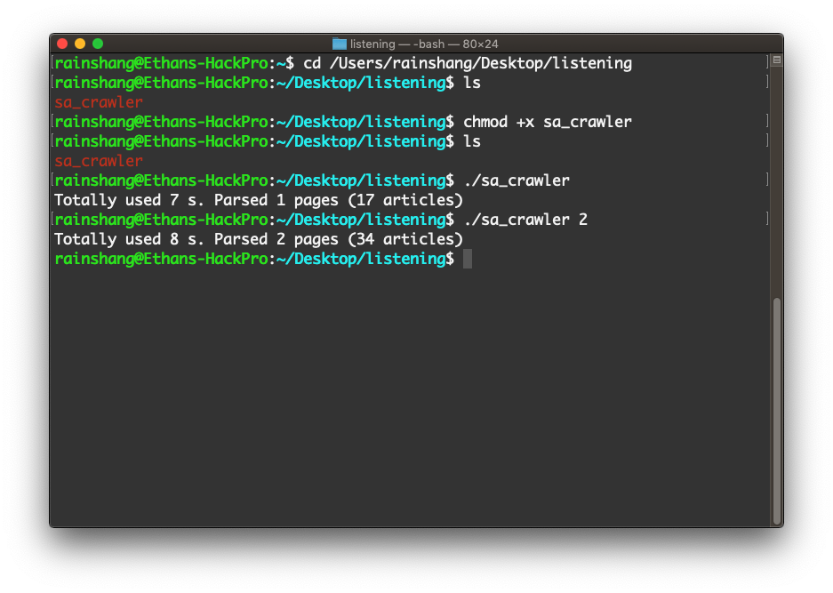
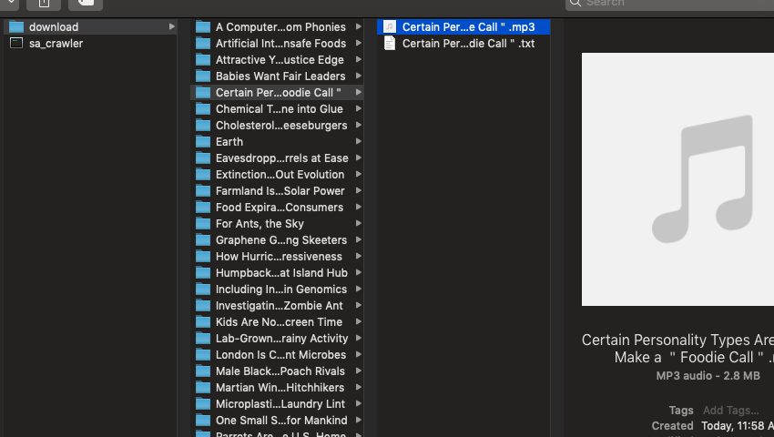

# [Scientific America 60s Science](https://www.scientificamerican.com/podcasts/) crawler
## Background
I'm suffering from PTE 79 scores. I believe you know what I mean...

Thus, to practice listening, I plan to store the audio in my phone and listen to it during the traffic time.

However, I didn't find any bundled resources. So I decided to do it myself.

My first choice is Python. Well, coincidentally, I'm working on a Go backend. So there it is!
## Implementation
I use [Colly](https://github.com/gocolly/colly) for parse and Goroutines for each grids page, full transcript page and audio file downloading.
## Example
### For Windows 64-bit user
Just download it and double-click the `.exe` file. It will download everything into the `download` directory at the same path as the `.exe` file.

***Advanced opition*** see [For Mac user](#for-mac-user)

### For Mac user
Launch `Terminal` and `cd` the path of the binary file.

Execute the executable file directly or with the argument to indicate how many pages you want crawl. The default operation is to crawl the latest page.

## Download
I have to spend any piece of time on PTE, so don't have more time to refine it. 

Here is the [v0.1](https://github.com/rainshang/60sScienceCrawler/releases/tag/v0.1) release. Not fancy but workable.

Enjoy! And good luck on your PTE ;)